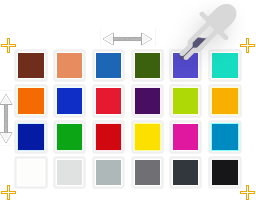

# MacBlend

Calibrate images containing a Macbeth ColorChecker directly in Blender.

MacBlend samples chart patches, calculates forward and inverse color transforms, creates compositor or shader nodes, and exports the results as `.cube` LUTs. It calculates the $3 \times 3$ matrix that best conforms the sampled input to a specified color-space gamut or to a chart sampled from another image.

## Requirements

- Blender 4.2 or newer
- A source image containing a Macbeth chart
- Scene-linear source and target data
- Correct image input transforms (IDTs) in Blender

The image [**Color Space**](https://docs.blender.org/manual/en/4.2/editors/image/image_settings.html#bpy-types-colormanagedinputcolorspacesettings-name) setting in the [Image Editor](https://docs.blender.org/manual/en/4.2/editors/image/index.html) sidebar must describe the image encoding. When **Use reference values as target** is enabled, the target gamut must match Blender's scene-linear working gamut after that input transform. MacBlend auto-detects supported working gamuts when a calibration source image is selected and shows the detection status below the target selector. When no explicit alias matches, it reports the failure and keeps **Linear Rec. 709** selected as a manually overridable fallback.

## Tutorial

### 1. Image Editor

Align the chart sampler with the chart in the image, set the patch sample size, and select **Sample Chart**.

Optionally repeat this process on a second image to create an image-to-image transform, such as matching camera A to camera B.

### 2. Compositor or Shader Editor

Select the sampled source image. Choose the reference-target gamut, configure normalization and separate exposure-node creation, name the transform, and select **Forward** or **Inverse**.

To use the second sampled image as the target, disable **Use reference values as target** and select that image. Select **Export LUTs** to write both transform directions as `.cube` files.

## Method and limitations

MacBlend perspective-warps each patch footprint from rectified chart space, averages its RGB values, and uses a least-squares fit across all 24 patches to calculate one $3 \times 3$ matrix. Optional normalization uses the Neutral 5 patch to separate a global exposure scale from the matrix.

This is a linear approximation, not a general color grade or full camera characterization. It cannot reproduce gamma changes, tone curves, clipping, local adjustments, or hue-selective corrections. Results are most reliable with scene-linear, minimally processed, evenly exposed material. Built-in chart values are based on D65; substantial differences between the capture illuminant and D65 can increase error.

## Installation

Install MacBlend from the [Blender Extensions platform](https://extensions.blender.org/add-ons/macblend/).

The simplest installation methods are:

1. Search for **MacBlend** in Blender's [**Edit > Preferences > Get Extensions**](https://docs.blender.org/manual/en/4.2/editors/preferences/extensions.html#installing-extensions) view and select **Install**.
2. Open the Blender Extensions page in a browser and drag the install link onto a running Blender window.

If the Extensions platform is unavailable, download an extension ZIP from [GitHub releases](https://github.com/ManuelHouben/macblend/releases), then use [**Edit > Preferences > Get Extensions > Install from Disk**](https://docs.blender.org/manual/en/4.2/editors/preferences/extensions.html#extension-settings).

Development checkouts can be launched directly with the [Blender Development](https://marketplace.visualstudio.com/items?itemName=JacquesLucke.blender-development) extension for VS Code.

## Documentation

The user manual is available at [manuelhouben.github.io/macblend](https://manuelhouben.github.io/macblend/). It covers IDTs and scene-linear data, chart sampling, matrix calculation, assumptions and limitations, node workflows, and LUT export.

Report bugs through the [issue tracker](https://github.com/ManuelHouben/macblend/issues). Include the Blender and MacBlend versions, image color-space settings, and reproduction steps.

## License

MacBlend is licensed under the [GNU General Public License v3.0 or later](LICENSE).

## Acknowledgements

MacBlend owes much to Marco Meyer's [mmColorTarget](https://www.marcomeyer-vfx.de/posts/mmcolortarget-nuke-gizmo/), Jed Smith's [CalibrateMacbeth](https://gist.github.com/jedypod/798b365ea64e8121999e7036ae7e0217), and Paul Schlichter's [Colour Chart Camera Matcher](https://paulschlichter.gumroad.com/l/ccc_matcher) add-on.
